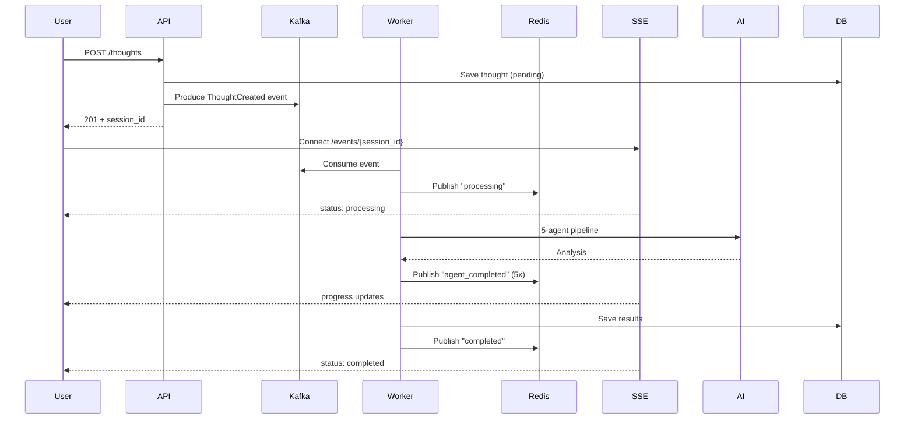

# AI Thought Processor

A scalable AI system for analyzing thoughts using a 5-agent pipeline with Kafka streaming, real-time updates via SSE, and semantic caching.

## Features

- **5-Agent Pipeline**: Classification → Analysis → Value Assessment → Action Planning → Prioritization
- **Real-Time Updates**: Server-Sent Events (SSE) for live progress tracking
- **Event-Driven Architecture**: Kafka for scalable message processing with 3 partitions
- **Multi-Provider AI**: Support for Anthropic Claude, OpenAI GPT, Google Gemini
- **Semantic Caching**: pgvector-powered caching to avoid reprocessing similar thoughts
- **Anonymous Users**: Rate-limited (3 thoughts) for unauthenticated access
- **Payment Integration**: Stripe subscriptions (Free/Pro/Enterprise tiers)
- **Comprehensive Testing**: 27 integration tests including direct Kafka producer/consumer validation

## Quick Start

```bash
# 1. Clone and setup
git clone https://github.com/Mieraidihaimu/RAGMultiAgent.git
cd RAGMultiAgent
cp .env.example .env

# 2. Add your AI API key to .env
# Google Gemini (recommended): https://aistudio.google.com/app/apikey
AI_PROVIDER=google
GOOGLE_API_KEY=your-key-here

# 3. Start services
docker compose up -d

# 4. Open web UI
open http://localhost:3000
```

Visit http://localhost:8000/docs for API documentation.

## System Architecture

```mermaid
graph TB
    subgraph "Frontend"
        UI[Web UI :3000]
    end
    
    subgraph "API Layer"
        API[FastAPI :8000]
        SSE[SSE Endpoint]
    end
    
    subgraph "Message Broker"
        KAFKA[Kafka<br/>3 Partitions]
    end
    
    subgraph "Processing"
        W1[Worker 1]
        W2[Worker 2]
        W3[Worker 3]
        CACHE[Semantic Cache]
    end
    
    subgraph "Data"
        DB[(PostgreSQL<br/>+pgvector)]
        REDIS[(Redis)]
    end
    
    subgraph "AI"
        AI[Gemini/Claude/GPT]
    end
    
    UI -->|Submit Thought| API
    UI -->|Listen Updates| SSE
    API -->|Produce Event| KAFKA
    KAFKA -->|Consume| W1 & W2 & W3
    W1 & W2 & W3 -->|Check Cache| CACHE
    W1 & W2 & W3 -->|Process| AI
    W1 & W2 & W3 -->|Publish Progress| REDIS
    SSE -->|Stream Events| REDIS
    API & W1 & W2 & W3 <-->|Read/Write| DB
    CACHE <-->|Vector Search| DB
```

### Data Flow



## API Overview

Visit **http://localhost:8000/docs** for interactive API documentation.

### Key Endpoints

- `POST /anonymous/thoughts` - Submit thought (anonymous, rate-limited)
- `POST /signup` - Create account
- `POST /login` - Authenticate
- `GET /events/{session_id}` - SSE stream for real-time updates
- `GET /api/stripe-config` - Get Stripe publishable key
- `GET /health` - System health check

### 5-Agent Pipeline

1. **Classifier** - Type, urgency, emotional tone
2. **Analyzer** - Context analysis based on user profile
3. **Value Assessor** - Impact across life dimensions
4. **Action Planner** - Concrete steps with timing
5. **Prioritizer** - Priority level + reasoning

Processing time: ~15-20 seconds with Gemini

## Configuration

### Environment Variables (.env)

```bash
# AI Provider (choose one)
AI_PROVIDER=google                    # google | anthropic | openai
GOOGLE_API_KEY=your_key
GOOGLE_MODEL=gemini-2.0-flash-exp

# Database
DATABASE_URL=postgresql://user:pass@db:5432/thoughtprocessor

# Kafka
KAFKA_BOOTSTRAP_SERVERS=kafka:9092
KAFKA_ENABLED=true

# Redis
REDIS_URL=redis://redis:6379

# Stripe (optional)
STRIPE_SECRET_KEY=sk_test_...
STRIPE_PUBLISHABLE_KEY=pk_test_...
```

### Switching AI Providers

| Provider | Cost/Month* | Speed | Quality |
|----------|-------------|-------|---------|
| Google Gemini | ~$3 | Fast | Good |
| Anthropic Claude | ~$17 | Medium | Best |
| OpenAI GPT-4 | ~$30 | Medium | Great |

*Estimated for 20 thoughts/day with caching

## Project Structure

```
RAGMultiAgent/
├── api/                  # FastAPI backend
│   ├── main.py          # Routes + SSE
│   ├── auth_routes.py   # Authentication
│   └── payment_routes.py # Stripe integration
├── batch_processor/     # Kafka consumers (3 workers)
│   ├── agents.py        # 5-agent pipeline
│   └── processor.py     # Event processing
├── kafka/               # Kafka producer/consumer
│   ├── producer.py      # Event publishing
│   ├── consumer.py      # Event consumption
│   └── events.py        # Event schemas
├── frontend/            # Web UI
├── tests/               # Integration tests (27 tests)
└── docker-compose.yml   # Service orchestration
```

## Testing

```bash
# Run all 27 integration tests
docker-compose --profile test run --rm integration-tests pytest -v

# Run specific test suite
docker-compose --profile test run --rm integration-tests pytest test_kafka_direct.py -v
```

Test coverage:
- Health checks (2 tests)
- Anonymous user workflow (4 tests)
- Database operations (4 tests)
- Stripe integration (3 tests)
- Kafka integration - indirect (5 tests)
- Kafka integration - direct (9 tests)

See [tests/README.md](tests/README.md) for details.

## Common Commands

```bash
# Start/stop services
docker compose up -d
docker compose down

# View logs
docker compose logs -f api
docker compose logs -f kafka-worker

# Rebuild after changes
docker compose up -d --build

# Run integration tests
docker-compose --profile test run --rm integration-tests

# Database console
docker compose exec db psql -U thoughtprocessor
```

## Documentation

- [QUICK_START.md](QUICK_START.md) - Detailed getting started guide
- [tests/README.md](tests/README.md) - Integration test documentation
- [SAAS_SETUP.md](SAAS_SETUP.md) - Payment & subscription setup

## Tech Stack

- **Backend**: FastAPI, Python 3.11
- **Database**: PostgreSQL + pgvector
- **Message Broker**: Apache Kafka (KRaft mode)
- **Cache**: Redis (SSE pub/sub)
- **Frontend**: HTML/JS, nginx
- **Payments**: Stripe
- **AI**: Google Gemini / Anthropic Claude / OpenAI GPT
- **Infrastructure**: Docker Compose

---

**License**: MIT  
**Version**: 2.0.0

Built with ❤️ and AI collaboration
