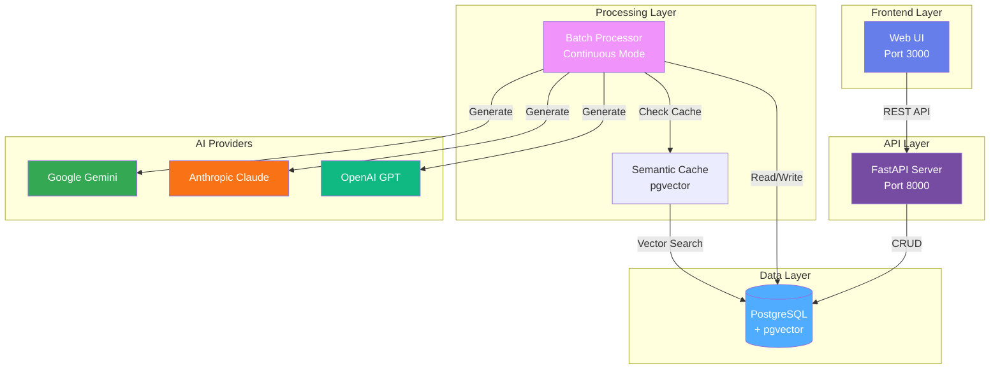
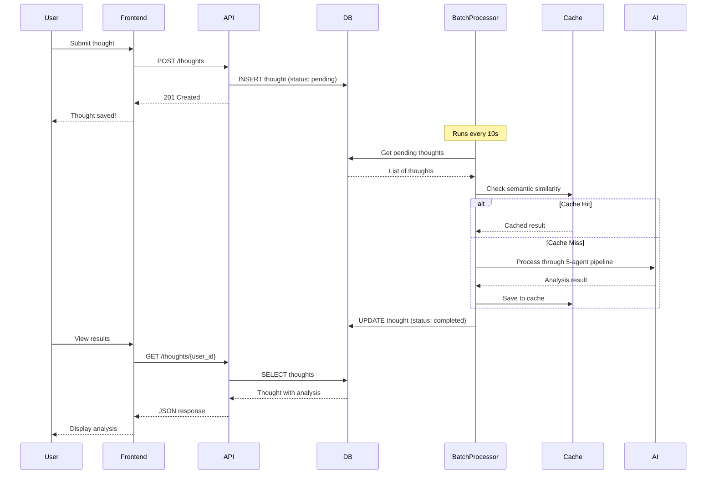
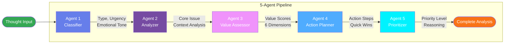
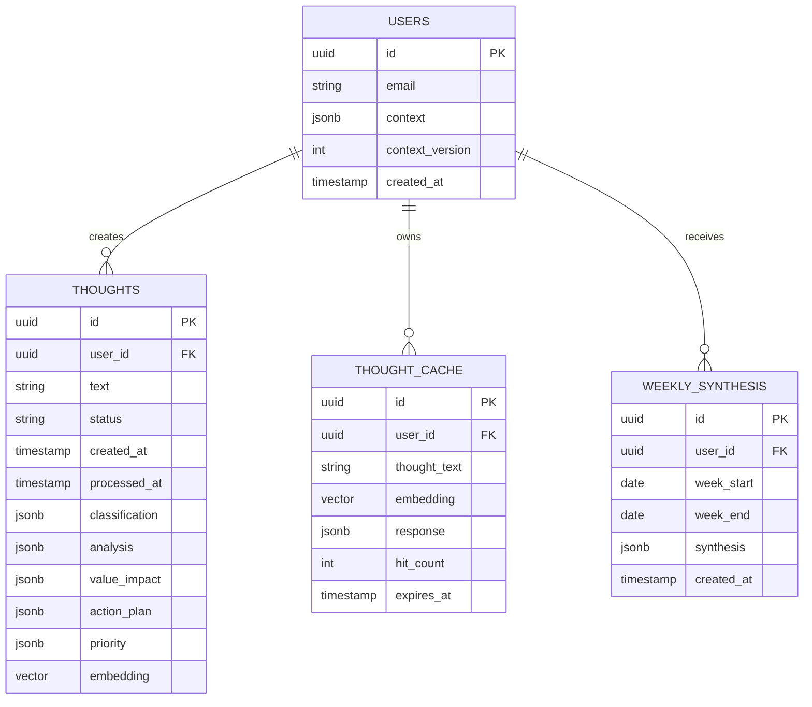

# AI Thought Processor

> **⚡ Built with AI Vibes** - This project was thoroughly vibe-coded with AI assistance, iterating through ideas and implementations to create a functional multi-agent thought processing system.

A Docker-based AI system that analyzes personal thoughts using a 5-agent pipeline with semantic caching. Supports multiple AI providers (Anthropic Claude, OpenAI, Google Gemini).

## Features

- **5-Agent Pipeline**: Classification → Analysis → Value Assessment → Action Planning → Prioritization
- **Multi-Provider Support**: Use Anthropic Claude, OpenAI GPT, or Google Gemini
- **Semantic Caching**: Avoid processing similar thoughts twice (pgvector)
- **Docker Everything**: API + Database + Batch Processor all containerized
- **REST API**: FastAPI backend with automatic documentation

## Quick Start

### Prerequisites

- Docker & Docker Compose
- API key for your chosen provider:
  - **Google Gemini** (recommended, cheapest): Get from [Google AI Studio](https://aistudio.google.com/app/apikey)
  - **Anthropic Claude**: From [Anthropic Console](https://console.anthropic.com/)
  - **OpenAI**: From [OpenAI Platform](https://platform.openai.com/)

### Setup & Run

```bash
# 1. Clone the repo
git clone https://github.com/Mieraidihaimu/RAGMultiAgent.git
cd RAGMultiAgent

# 2. Create .env file
cp .env.example .env

# 3. Edit .env and add your API key
# For Google Gemini (recommended):
AI_PROVIDER=google
GOOGLE_API_KEY=your-key-here

# 4. Start everything
docker compose up -d

# 5. Open the web UI
open http://localhost:3000

# Or check the API is working
curl http://localhost:8000/health
```

### Using the Frontend

1. Open http://localhost:3000 in your browser
2. Enter a thought (e.g., "Should I learn Rust or Go?")
3. Click "Submit Thought"
4. Wait ~10 seconds or click "Process Pending Thoughts"
5. Click "🔄 Refresh" to see your analyzed thought with AI insights

### Using the API

```bash
# Create a thought
curl -X POST http://localhost:8000/thoughts \
  -H "Content-Type: application/json" \
  -d '{
    "text": "Should I switch careers to AI/ML? I have 5 years of web dev experience.",
    "user_id": "a0eebc99-9c0b-4ef8-bb6d-6bb9bd380a11"
  }'

# Process it through the AI pipeline
docker compose exec batch-processor python processor.py

# View the analysis
curl http://localhost:8000/thoughts/a0eebc99-9c0b-4ef8-bb6d-6bb9bd380a11 | python -m json.tool
```

## System Architecture

### High-Level Architecture



### Data Flow Diagram



### 5-Agent Processing Pipeline



### Database Schema



## How It Works

### The 5-Agent Pipeline

Your thought goes through 5 specialized AI agents:

1. **Classifier** - Extracts type, urgency, emotional tone, entities
2. **Analyzer** - Provides deep context based on your goals and constraints
3. **Value Assessor** - Rates impact across 5 life dimensions (career, health, family, etc.)
4. **Action Planner** - Creates concrete, actionable steps with timing
5. **Prioritizer** - Determines priority level (Critical/High/Medium/Low)

**Processing time**: ~18 seconds per thought (with Google Gemini)

### API Endpoints

**Interactive docs**: http://localhost:8000/docs

- `POST /thoughts` - Create a thought
- `GET /thoughts/{user_id}` - List thoughts
- `GET /thoughts/{user_id}/{thought_id}` - Get specific thought
- `GET /health` - Check system status

## Configuration

## Configuration

### Switch AI Providers

Edit `.env`:

```bash
# Google Gemini (cheapest, fast)
AI_PROVIDER=google
GOOGLE_API_KEY=your-key-here
GOOGLE_MODEL=gemini-2.5-flash-lite

# Anthropic Claude (best quality)
AI_PROVIDER=anthropic
ANTHROPIC_API_KEY=sk-ant-your-key-here
ANTHROPIC_MODEL=claude-sonnet-4-20250514

# OpenAI GPT (alternative)
AI_PROVIDER=openai
OPENAI_API_KEY=sk-your-key-here
OPENAI_MODEL=gpt-4-turbo-preview
```

### User Context

Users need a context profile for personalized analysis. See `database/seeds/001_sample_user.sql` for an example.

## Project Structure

```
RAGMultiAgent/
├── api/                      # FastAPI backend
│   ├── main.py              # API routes
│   └── database.py          # DB adapter
├── batch_processor/         # AI pipeline
│   ├── agents.py            # 5-agent logic
│   ├── processor.py         # Batch orchestration
│   ├── ai_providers/        # Multi-provider support
│   └── semantic_cache.py    # Caching layer
├── common/database/         # Shared DB adapters
├── database/                # Schema & seeds
└── docker-compose.yml       # Container setup
```

## Costs (Estimated for 20 thoughts/day)

- **Google Gemini**: ~$3/month ⭐ (recommended)
- **Anthropic Claude**: ~$17-24/month
- **OpenAI GPT-4**: ~$30-40/month

*With semantic caching enabled*

## Common Commands

```bash
# Start/stop
docker compose up -d
docker compose down

# View logs
docker compose logs -f api
docker compose logs -f batch-processor

# Rebuild after code changes
docker compose up -d --build

# Process thoughts manually
docker compose exec batch-processor python processor.py

# Database console
docker compose exec db psql -U thoughtprocessor -d thoughtprocessor
```

## Troubleshooting

## Troubleshooting

**API not responding?**
```bash
docker compose logs api
docker compose restart api
```

**Database issues?**
```bash
docker compose logs db
docker compose restart db
```

**Agent pipeline failing?**
- Check your API key is correct in `.env`
- Verify you have credits with your AI provider
- Check logs: `docker compose logs batch-processor`

## Documentation

- `QUICKSTART_GEMINI.md` - Detailed Google Gemini setup
- `ARCHITECTURE.md` - System design details
- `ADAPTER_PATTERN_GUIDE.md` - Multi-provider implementation

## Acknowledgments

Built with love and AI assistance ❤️

**AI Providers:**
- [Google Gemini](https://ai.google.dev/) - Fast & affordable
- [Anthropic Claude](https://anthropic.com) - Best reasoning
- [OpenAI GPT](https://openai.com) - Industry standard

**Tech Stack:**
- [FastAPI](https://fastapi.tiangolo.com/) - Modern Python web framework
- [PostgreSQL](https://postgresql.org) + [pgvector](https://github.com/pgvector/pgvector) - Vector database
- [Docker](https://docker.com) - Containerization

---

**License**: MIT  
**Version**: 1.0.0

*This project was vibe-coded through iterative AI collaboration* 🤖✨
