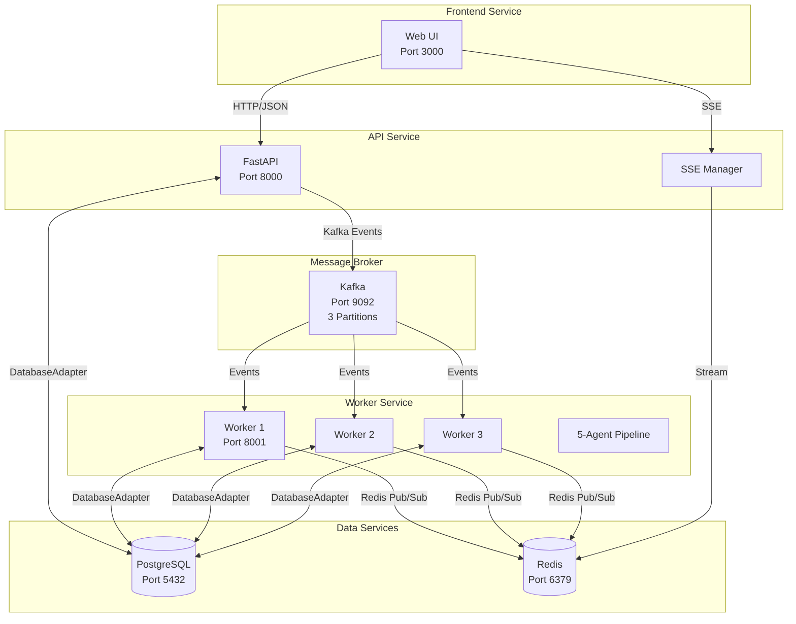

# Service Communication Contracts

**Version**: 1.0.0  
**Last Updated**: 2025-10-30  
**Status**: ✅ All contracts validated and enforced

This document defines the explicit communication contracts between all services in the RAG Multi-Agent thought processor system. Every service MUST communicate using these contracts to ensure system integrity, maintainability, and evolvability.

---

## 📋 Table of Contents

1. [Service Boundaries](#service-boundaries)
2. [Communication Protocols](#communication-protocols)
3. [Contract Definitions](#contract-definitions)
4. [Validation Requirements](#validation-requirements)
5. [Contract Evolution Strategy](#contract-evolution-strategy)
6. [Enforcement Mechanisms](#enforcement-mechanisms)
7. [Testing Contracts](#testing-contracts)

---

## 🏗️ Service Boundaries

### Service Overview



### Service Responsibilities

#### Frontend Service
- **Purpose**: User interface and client-side logic
- **Port**: 3000 (nginx)
- **Technology**: HTML/JS, MVC architecture
- **Inputs**: HTTP responses (JSON), SSE events
- **Outputs**: HTTP requests (JSON)
- **Contract Files**: N/A (consumes API contracts)

#### API Service
- **Purpose**: Request validation, authentication, event publishing, SSE streaming
- **Port**: 8000 (FastAPI)
- **Technology**: Python 3.11, FastAPI, Pydantic
- **Inputs**: HTTP requests from frontend
- **Outputs**: HTTP responses, Kafka events, SSE streams
- **Contract Files**: 
  - `api/models.py` - API request/response models
  - `common/schemas/api_schemas.py` - Shared API contracts
  - `common/schemas/event_schemas.py` - Kafka event contracts

#### Kafka Message Broker
- **Purpose**: Event streaming, message persistence, partitioning
- **Port**: 9092 (KRaft mode)
- **Technology**: Apache Kafka 3.x
- **Configuration**: 3 partitions, partition by `user_id`
- **Topics**: `thought-events`
- **Contract Files**: `common/schemas/event_schemas.py`

#### Worker Service (3 instances)
- **Purpose**: Event consumption, AI processing, database updates, SSE broadcasting
- **Port**: 8001 (metrics), 8002, 8003
- **Technology**: Python 3.11, aiokafka, asyncio
- **Inputs**: Kafka events
- **Outputs**: Database writes, Redis pub/sub (SSE events)
- **Contract Files**:
  - `common/schemas/event_schemas.py` - Kafka event contracts
  - `common/schemas/ai_schemas.py` - AI output contracts

#### Database Service
- **Purpose**: Persistent storage, vector similarity search
- **Port**: 5432 (PostgreSQL + pgvector)
- **Technology**: PostgreSQL 15, pgvector extension
- **Access**: ONLY via `DatabaseAdapter` interface
- **Contract Files**: `common/database/base.py` - Adapter interface

#### Redis Service
- **Purpose**: SSE pub/sub, session management, rate limiting
- **Port**: 6379
- **Technology**: Redis 7.x
- **Channels**: `thought_updates:{user_id}`
- **Contract Files**: `common/schemas/event_schemas.py` - SSE event schemas

---

## 📡 Communication Protocols

### 1. Frontend ↔ API (HTTP/REST)

**Protocol**: HTTP/1.1, JSON payloads  
**Authentication**: JWT Bearer tokens (except anonymous endpoints)  
**Validation**: Pydantic models in `api/models.py`

**Request Contract**:
```python
# api/models.py
class ThoughtInput(BaseModel):
    text: str = Field(..., min_length=1, max_length=10000)
    user_id: UUID
    processing_mode: Literal['single', 'group'] = 'single'
    group_id: Optional[UUID] = None
```

**Response Contract**:
```python
class ThoughtResponse(BaseModel):
    id: UUID
    user_id: UUID
    text: str
    status: Literal['pending', 'processing', 'completed', 'failed']
    created_at: datetime
    message: str
```

**Validation**:
- ✅ Automatic via FastAPI + Pydantic
- ✅ Returns 422 for validation errors
- ✅ OpenAPI schema auto-generated

**Example**:
```http
POST /thoughts HTTP/1.1
Authorization: Bearer <jwt_token>
Content-Type: application/json

{
  "text": "Should I learn Rust?",
  "user_id": "123e4567-e89b-12d3-a456-426614174000",
  "processing_mode": "single"
}
```

### 2. API → Kafka (Event Streaming)

**Protocol**: Kafka binary protocol  
**Serialization**: JSON (Pydantic → JSON)  
**Partitioning**: By `user_id` hash (ensures ordering per user)  
**Validation**: Pydantic models in `common/schemas/event_schemas.py`

**Event Contract**:
```python
# common/schemas/event_schemas.py
class ThoughtCreatedEvent(BaseEvent):
    event_type: Literal['thought_created'] = 'thought_created'
    user_id: str
    thought_id: str
    text: str
    user_context: Optional[Dict[str, Any]] = None
    processing_mode: Literal['single', 'group'] = 'single'
    group_id: Optional[str] = None
```

**Publishing**:
```python
# kafka/producer.py
await producer.send_thought_created(
    user_id=str(user_id),
    thought_id=str(thought_id),
    text=thought.text,
    user_context=user_context,
    processing_mode=thought.processing_mode,
    group_id=str(thought.group_id) if thought.group_id else None
)
```

**Validation**:
- ✅ Pydantic model validation before publishing
- ✅ Serialization via `.model_dump_json()`
- ✅ Deserialization with schema mapping

### 3. Kafka → Workers (Event Consumption)

**Protocol**: Kafka Consumer Group (`thought-processor-group`)  
**Deserialization**: JSON → Pydantic  
**Partition Assignment**: Round-robin across 3 workers  
**Validation**: Schema-based deserialization

**Consumption**:
```python
# kafka/consumer.py
async for message in consumer:
    event = deserialize_event(message.value)  # Returns validated Pydantic model
    await processor.process_event(event)
```

**Error Handling**:
- Invalid JSON → Log error + Dead Letter Queue (DLQ)
- Validation failure → Log error + DLQ
- Processing failure → Retry with exponential backoff

### 4. Workers → Redis (SSE Pub/Sub)

**Protocol**: Redis Pub/Sub  
**Channel**: `thought_updates:{user_id}`  
**Serialization**: JSON (Pydantic → JSON)  
**Validation**: Pydantic SSE event schemas

**SSE Event Contract**:
```python
# common/schemas/event_schemas.py
class SSEThoughtProcessingEvent(SSEEventBase):
    event: Literal['thought_processing'] = 'thought_processing'
    timestamp: datetime = Field(default_factory=datetime.utcnow)
    data: Dict[str, Any]
```

**Publishing**:
```python
# batch_processor/processor.py
sse_event = SSEThoughtProcessingEvent(
    event='thought_processing',
    data={
        'thought_id': str(thought_id),
        'status': 'processing',
        'message': 'Starting AI analysis...'
    }
)
await redis.publish(channel, sse_event.to_json_str())
```

**Validation**:
- ✅ Pydantic model validation before publishing
- ✅ Schema-based serialization
- ✅ Type-safe event data

### 5. Redis → API (SSE Streaming)

**Protocol**: Server-Sent Events (SSE)  
**Subscription**: Redis channel per user  
**Format**: `event: <type>\ndata: <json>\n\n`

**Streaming**:
```python
# api/sse.py
async for message in pubsub.listen():
    if message['type'] == 'message':
        data = json.loads(message['data'])
        yield f"event: {data['event']}\ndata: {json.dumps(data)}\n\n"
```

### 6. API/Workers ↔ Database (Adapter Pattern)

**Protocol**: DatabaseAdapter interface (abstraction layer)  
**Implementation**: PostgreSQLAdapter (with encryption)  
**Validation**: Method signatures, type hints  
**Access Rule**: ⚠️ **NEVER bypass adapter with direct SQL**

**Adapter Contract**:
```python
# common/database/base.py
class DatabaseAdapter(ABC):
    @abstractmethod
    async def create_thought(self, user_id: str, text: str, **kwargs) -> Dict[str, Any]:
        pass
    
    @abstractmethod
    async def get_user_by_email(self, email: str) -> Optional[Dict[str, Any]]:
        pass
    
    @abstractmethod
    async def update_user_consent(self, user_id: str, consent_updates: Dict[str, Any]) -> Dict[str, Any]:
        pass
```

**Usage**:
```python
# ✅ CORRECT
user = await db.get_user_by_email(email)

# ❌ WRONG - Bypasses adapter
async with db.pool.acquire() as conn:
    user = await conn.fetchrow("SELECT * FROM users WHERE email = $1", email)
```

**Validation**:
- ✅ Type hints enforced
- ✅ Method signatures defined in ABC
- ✅ Implementation required for all adapters
- ✅ Test suite validates contract adherence (`tests/test_service_contracts.py`)

---

## 📜 Contract Definitions

### API Request/Response Contracts

**Location**: `api/models.py`, `common/schemas/api_schemas.py`

**Models** (18 total):
- `ThoughtInput` - Thought creation request
- `AnonymousThoughtInput` - Anonymous thought request
- `ThoughtResponse` - Thought creation response
- `ThoughtDetail` - Full thought with analysis
- `ThoughtsListResponse` - Paginated thought list
- `UserContextUpdate` - User context update
- `PersonaInput` - Persona creation
- `PersonaResponse` - Persona details
- `PersonaGroupInput` - Group creation
- `PersonaGroupResponse` - Group details
- `LoginRequest` - Authentication
- `Token` - JWT token response
- `UserResponse` - User info
- `ErrorResponse` - Error format
- `SSEEvent` - SSE event structure
- `HealthResponse` - Health check
- `ConsentUpdate` - Consent preferences
- `StripeConfigResponse` - Stripe config

### Kafka Event Contracts

**Location**: `common/schemas/event_schemas.py`

**Event Types**:
1. `ThoughtCreatedEvent` - API → Kafka (triggers processing)
2. `ThoughtProcessingEvent` - Worker → Kafka (status update)
3. `ThoughtAgentCompletedEvent` - Worker → Kafka (agent done)
4. `ThoughtCompletedEvent` - Worker → Kafka (all done)
5. `ThoughtFailedEvent` - Worker → Kafka (processing failed)

**Schema Evolution**: Add new optional fields, never remove or rename

### SSE Event Contracts

**Location**: `common/schemas/event_schemas.py`

**Event Types**:
1. `SSEThoughtProcessingEvent` - Processing started
2. `SSEAgentCompletedEvent` - Agent completed
3. `SSEThoughtCompletedEvent` - All completed
4. `SSEThoughtFailedEvent` - Processing failed
5. `SSEGroupProcessingEvent` - Group processing started
6. `SSEPersonaCompletedEvent` - Persona completed
7. `SSEConsolidationEvent` - Consolidation started

**Contract**:
```python
class SSEEventBase(BaseModel):
    event: str
    timestamp: datetime = Field(default_factory=datetime.utcnow)
    data: Dict[str, Any]
    
    def to_json_str(self) -> str:
        return self.model_dump_json()
```

### AI Agent Output Contracts

**Location**: `common/schemas/ai_schemas.py`

**Agent Outputs**:
1. `ClassificationOutput` - Agent 1 (type, urgency, entities, tone, needs)
2. `AnalysisOutput` - Agent 2 (goal alignment, needs, patterns, assessment)
3. `ValueImpactOutput` - Agent 3 (5 value scores + weighted total)
4. `ActionPlanOutput` - Agent 4 (quick wins, main actions, metrics)
5. `PriorityOutput` - Agent 5 (priority level, timeline, recommendation)

**Validation Enforcement**:
```python
# batch_processor/agents.py
async def classify(self, thought_text: str, user_context: Dict) -> Dict:
    result = await self._generate_json_response(prompt, user_context)
    
    # ✅ Validate before returning
    validated = ClassificationOutput(**result)
    return validated.model_dump()
```

### Database Adapter Contracts

**Location**: `common/database/base.py`

**Core Methods** (26 total):
- **Thought Operations**: `create_thought()`, `get_thought()`, `get_thoughts()`, `update_thought()`, `delete_thought()`, `get_pending_thoughts()`
- **User Operations**: `get_user()`, `get_user_by_email()`, `update_user_context()`, `get_user_consent_status()`, `update_user_consent()`
- **Cache Operations**: `find_similar_cached_thought()`, `save_to_cache()`, `cleanup_expired_cache()`
- **Synthesis Operations**: `save_weekly_synthesis()`, `get_latest_synthesis()`, `get_syntheses()`
- **Persona Operations**: `create_persona()`, `get_persona()`, `get_user_personas()`, `update_persona()`, `delete_persona()`
- **Group Operations**: `create_persona_group()`, `get_persona_group()`, `get_user_groups()`, `delete_persona_group()`
- **Connection**: `connect()`, `disconnect()`, `health_check()`

**Contract Adherence**:
- ✅ All methods MUST be implemented in adapter
- ✅ Return types MUST match base class
- ✅ Never bypass adapter with direct SQL
- ✅ Encryption handled transparently by adapter

---

## ✅ Validation Requirements

### 1. API Request Validation

**Enforcement**: Automatic via FastAPI + Pydantic

**Requirements**:
- All request bodies MUST have Pydantic models
- Field constraints MUST be defined (min/max length, regex, etc.)
- Custom validators MUST be @validator decorated
- OpenAPI schema MUST auto-generate

**Example**:
```python
class ThoughtInput(BaseModel):
    text: str = Field(..., min_length=1, max_length=10000)
    
    @validator('text')
    def validate_text_not_empty(cls, v):
        if not v.strip():
            raise ValueError('Text cannot be empty')
        return v
```

### 2. Kafka Event Validation

**Enforcement**: Schema-based serialization/deserialization

**Requirements**:
- All Kafka events MUST inherit from `BaseEvent`
- Event type MUST be Literal (enforces exact string)
- Serialization MUST use `.model_dump_json()`
- Deserialization MUST use schema mapping

**Example**:
```python
# Publishing
event = ThoughtCreatedEvent(user_id="123", thought_id="456", text="Test")
await producer.send(event.model_dump_json())

# Consuming
event = EVENT_SCHEMA_MAP[event_type](**json.loads(message))
```

### 3. SSE Event Validation

**Enforcement**: Pydantic models with `.to_json_str()`

**Requirements**:
- All SSE events MUST inherit from `SSEEventBase`
- Event name MUST be Literal
- Timestamp MUST be auto-generated
- Data MUST be dict (allows flexible payload)

### 4. AI Output Validation

**Enforcement**: Pydantic validation in agent methods

**Requirements**:
- All agent outputs MUST be validated against schemas
- Validation errors MUST be logged
- Invalid outputs MUST return error dict for debugging
- Valid outputs MUST use `.model_dump()`

**Example**:
```python
try:
    validated = ClassificationOutput(**ai_response)
    return validated.model_dump()
except ValidationError as e:
    logger.error(f"Validation failed: {e}")
    return {"error": "Validation failed", "details": str(e), "raw": ai_response}
```

### 5. Database Adapter Validation

**Enforcement**: Abstract base class + integration tests

**Requirements**:
- All adapters MUST implement all abstract methods
- Method signatures MUST match base class exactly
- Return types MUST be type-hinted
- No direct database access outside adapter

**Validation**:
- Mypy type checking
- Integration tests (`tests/test_service_contracts.py`)
- Runtime checks for adapter contract adherence

---

## 🔄 Contract Evolution Strategy

### Versioning Principles

1. **Backward Compatibility**: New fields are OPTIONAL, existing fields are NEVER removed
2. **Deprecation Period**: 3 months notice before removing deprecated fields
3. **Version Headers**: API uses version prefix (future: `/v1/`, `/v2/`)
4. **Schema Versions**: Events include `schema_version` field (future)

### Adding New Fields

**✅ Allowed** (backward compatible):
```python
class ThoughtInput(BaseModel):
    text: str
    user_id: UUID
    tags: Optional[List[str]] = []  # NEW: Optional field with default
```

**❌ Not Allowed** (breaking change):
```python
class ThoughtInput(BaseModel):
    content: str  # BREAKING: Renamed from 'text'
    user_id: UUID
```

### Deprecation Process

1. **Announce**: Update documentation with deprecation notice
2. **Add Warning**: Log warning when deprecated field is used
3. **Dual Support**: Support both old and new fields for 3 months
4. **Remove**: After 3 months, remove deprecated field

**Example**:
```python
class ThoughtInput(BaseModel):
    text: str  # Current
    content: Optional[str] = None  # Deprecated (use 'text')
    
    @validator('content')
    def warn_deprecated(cls, v):
        if v is not None:
            logger.warning("Field 'content' is deprecated, use 'text'")
        return v
```

### Schema Migration

**Database Schema Changes**:
1. Create migration in `database/migrations/`
2. Test migration on staging
3. Run migration during maintenance window
4. Update adapter to support both schemas temporarily
5. Remove old schema support after confirmed success

**Kafka Schema Changes**:
1. Add new optional field to event schema
2. Update producer to include new field
3. Update consumer to handle presence/absence
4. After all consumers updated, make field required

---

## 🛡️ Enforcement Mechanisms

### 1. Compile-Time Validation

**Mypy Type Checking**:
```bash
mypy api/ batch_processor/ common/ --strict
```

**Pydantic Model Validation**:
- Automatic at instantiation
- Raises `ValidationError` for invalid data

### 2. Runtime Validation

**API Layer**:
- FastAPI automatically validates requests against Pydantic models
- Returns HTTP 422 for validation failures

**Worker Layer**:
- Manual validation in agent methods
- Log errors, return structured error responses

**Database Layer**:
- Adapter interface enforces method signatures
- Type hints enforced by mypy

### 3. Integration Testing

**Contract Tests** (`tests/test_service_contracts.py`):
- 50+ tests validating all contracts
- Tests for API-Kafka compatibility
- Tests for SSE event consistency
- Tests for AI output validation
- Tests for database adapter adherence

**Run Tests**:
```bash
docker-compose --profile test run --rm integration-tests pytest tests/test_service_contracts.py -v
```

### 4. Code Review Checklist

**Before Merging**:
- [ ] New endpoints have Pydantic request/response models
- [ ] New Kafka events extend `BaseEvent`
- [ ] New SSE events extend `SSEEventBase`
- [ ] AI outputs validated with Pydantic schemas
- [ ] Database access ONLY via adapter methods
- [ ] Integration tests updated
- [ ] Documentation updated

### 5. Monitoring & Alerts

**Metrics to Monitor**:
- API validation error rate (`http_requests_total{status="422"}`)
- Kafka deserialization failures
- AI output validation failures
- SSE event publishing failures

**Alert Thresholds**:
- Validation error rate > 5%
- Deserialization failures > 10/hour
- SSE publishing failures > 1%

---

## 🧪 Testing Contracts

### Running Contract Tests

**All Contract Tests**:
```bash
docker-compose --profile test run --rm integration-tests pytest tests/test_service_contracts.py -v
```

**Specific Test Classes**:
```bash
# API-Kafka compatibility
pytest tests/test_service_contracts.py::TestAPIKafkaContractCompatibility -v

# SSE events
pytest tests/test_service_contracts.py::TestSSEEventSchemas -v

# AI outputs
pytest tests/test_service_contracts.py::TestAIAgentOutputSchemas -v

# Kafka events
pytest tests/test_service_contracts.py::TestKafkaEventSchemas -v

# Cross-service consistency
pytest tests/test_service_contracts.py::TestCrossServiceContractConsistency -v
```

### Test Coverage

**Current Coverage**:
- ✅ 10 API-Kafka compatibility tests
- ✅ 8 SSE event validation tests
- ✅ 12 AI output schema tests
- ✅ 10 Kafka event tests
- ✅ 6 cross-service consistency tests

**Total**: 46 contract validation tests

### Adding New Contract Tests

**When to Add**:
- New Pydantic model created
- New event type added
- New database adapter method
- New SSE event type
- Breaking change to existing contract

**Template**:
```python
class TestNewFeatureContract:
    """Test contract for new feature"""
    
    def test_request_model_validation(self):
        """Test request model accepts valid data"""
        model = NewRequestModel(field1="value1", field2=42)
        assert model.field1 == "value1"
        
    def test_request_model_rejects_invalid(self):
        """Test request model rejects invalid data"""
        with pytest.raises(ValidationError):
            NewRequestModel(field1="", field2=-1)  # Invalid values
```

---

## 📚 Contract Reference Quick Links

### Documentation
- [ARCHITECTURE.md](ARCHITECTURE.md) - System architecture
- [README.md](README.md) - Project overview
- [QUICK_START.md](QUICK_START.md) - Getting started
- [MONITORING.md](MONITORING.md) - Monitoring & observability

### Schema Definitions
- `api/models.py` - API models (18 models)
- `common/schemas/api_schemas.py` - Shared API schemas
- `common/schemas/event_schemas.py` - Event schemas (Kafka + SSE)
- `common/schemas/ai_schemas.py` - AI output schemas
- `common/database/base.py` - Database adapter interface

### Implementations
- `kafka/producer.py` - Kafka event publishing
- `kafka/consumer.py` - Kafka event consumption
- `batch_processor/processor.py` - SSE event publishing
- `batch_processor/agents.py` - AI output validation
- `common/database/postgres_adapter.py` - Database adapter implementation

### Tests
- `tests/test_service_contracts.py` - Contract validation tests (46 tests)
- `tests/test_kafka_direct.py` - Kafka integration tests (9 tests)
- `tests/test_anonymous_user.py` - Anonymous workflow tests (4 tests)

---

## 🎯 Contract Compliance Checklist

Use this checklist when developing new features:

### API Endpoints
- [ ] Request model defined in `api/models.py` or `common/schemas/api_schemas.py`
- [ ] Response model defined with all fields
- [ ] Field validation rules defined (min/max, regex, custom validators)
- [ ] OpenAPI documentation auto-generated
- [ ] Integration test created

### Kafka Events
- [ ] Event schema extends `BaseEvent`
- [ ] Event type is `Literal` (exact string match)
- [ ] All required fields defined
- [ ] Added to `EVENT_SCHEMA_MAP` for deserialization
- [ ] Integration test created

### SSE Events
- [ ] Event schema extends `SSEEventBase`
- [ ] Event name is `Literal`
- [ ] Data payload allows flexible structure
- [ ] Added to `SSE_EVENT_SCHEMA_MAP`
- [ ] Publishing uses `.to_json_str()`

### AI Outputs
- [ ] Output schema defined in `common/schemas/ai_schemas.py`
- [ ] Validation added to agent method
- [ ] Validation errors logged
- [ ] Invalid outputs return structured error
- [ ] Integration test created

### Database Operations
- [ ] Access via `DatabaseAdapter` method
- [ ] No direct SQL outside adapter
- [ ] Method added to `DatabaseAdapter` base class if new
- [ ] Method implemented in `PostgreSQLAdapter`
- [ ] Return type matches interface
- [ ] Integration test created

---

## 📞 Support & Questions

**Contract Violations**:
- Review this document
- Check `tests/test_service_contracts.py` for examples
- Run contract tests: `pytest tests/test_service_contracts.py -v`

**Adding New Contracts**:
1. Define Pydantic model in appropriate schema file
2. Update service to use new model
3. Add validation tests
4. Update this documentation
5. Submit PR with checklist completed

**Breaking Changes**:
- Avoid if possible
- Follow deprecation process (3-month notice)
- Document in CHANGELOG
- Communicate to team

---

**Version History**:
- **1.0.0** (2025-10-30): Initial contract documentation with full validation enforcement

**Maintained by**: RAG Multi-Agent Team
